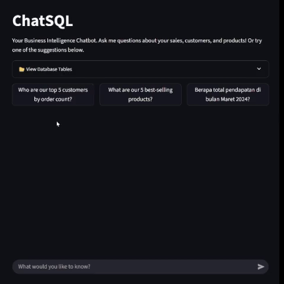

# ChatSQL: A Natural Language Business Intelligence Chatbot

**Live Demo: [https://chatsql-rifukawa.streamlit.app](https://chatsql-rifukawa.streamlit.app)**

This project is a proof-of-concept web application that allows non-technical users to query a SQL database using plain English. It leverages the power of Large Language Models (LLMs) to bridge the gap between complex data systems and business stakeholders.

<p align="center">
  
</p>


## The Problem

In many organizations, business intelligence is a bottleneck. Stakeholders need data to make decisions, but they must rely on data analysts to write custom SQL queries. This process can be slow and inefficient. ChatSQL is designed to solve this problem by providing a direct, conversational interface to the database.


## Features

- **Natural Language to SQL:** Translates plain English questions into executable SQL queries.
- **Conversational Interface:** Remembers chat history for follow-up questions.
- **Robust Agent Logic:** Uses a custom prompt to handle ambiguity and prevent database modification.
- **Responsive UI:** Provides loading feedback and handles errors gracefully.


## Tech Stack & Architecture

This application is built using a modern, AI-native stack:

- **AI Framework:** [LangChain](https://www.langchain.com/) (using the SQL Agent)
- **LLM:** OpenAI's `gpt-3.5-turbo-instruct` (LangChain's default OpenAI model)
- **Database:** SQLite
- **Backend/UI:** [Streamlit](https://streamlit.io/)
- **Environment:** Anaconda / Python 3.x

The architecture is straightforward: the Streamlit frontend captures user input and sends it to the LangChain SQL Agent. The agent uses an LLM to generate a SQL query, executes it against the SQLite database, and then uses the LLM again to formulate a final, human-readable answer.


## How to Run Locally

**Prerequisites:**
- Anaconda or Miniconda installed
- An OpenAI API Key

**Instructions:**
1.  **Clone the repository:**
    ```bash
    git clone https://github.com/arifaldi13/chatsql.git
    cd chatsql
    ```
2.  **Set up the Anaconda environment:**
    ```bash
    conda create --name chatsql
    conda activate chatsql
    pip install streamlit langchain langchain-community openai pandas sqlalchemy
    ```
3.  **Set up your API Key:**
    Create a `.env` file in the root directory and add your key:
    ```
    OPENAI_API_KEY="sk-..."
    ```
4.  **Create and populate the database:**
    *(You used a Jupyter Notebook, so explain that here.)*
    - Open `database_setup.ipynb` and run all cells to create and populate `bi_database.db`.

5.  **Launch the application:**
    ```bash
    streamlit run app.py
    ```

## Security Considerations

This is a proof-of-concept. Directly executing LLM-generated SQL queries in a production environment poses a significant security risk (SQL Injection). For a production-grade system, the following would be necessary:

- A robust validation and sanitization layer for all generated SQL.
- Strict, read-only database permissions for the application's role.
- Comprehensive monitoring and logging of all executed queries.